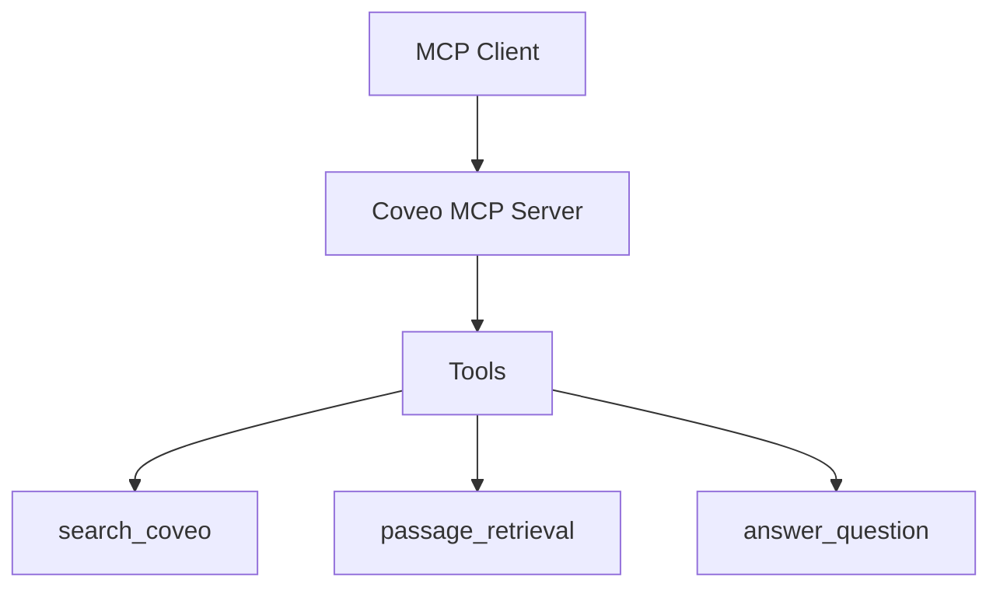

# Coveo MCP Server

> **Disclaimer**  
The Coveo MCP Server is provided as-is, intended purely for educational and exploratory purposes. It’s not a production-ready product.

## Overview
This is a simple MCP server that connects to **Coveo** and executes search queries. It provides tools for:

- Search functionality
- Passage retrieval
- Question answering

## Available Tools



### search_coveo
Queries the Coveo Search API and retrieves search results.
```
Input: query (string) - The search query text
Input: numberOfResults (int, optional) - The number of documents to retrieve from the index. Default: 5.
Output: Formatted search results or error message
```

### passage_retrieval
Queries the Coveo Passage Retrieval API and retrieves specific passages from documents that are relevant to a query.
```
Input: query (string) - The search query text
Output: Formatted passages or error message
```

### answer_question
Queries the Coveo Answer API (Relevance Generative Answering) and retrieves an answer to a question.
```
Input: query (string) - The question to answer
Output: Generated answer from Coveo sources with citations
```

## Features
- Asynchronous API requests using httpx
- Proper error handling
- Formatted responses for better readability
- Environment variable configuration
- Semantic passage retrieval for more precise information extraction

## Installation
1. **Clone the repository**
   ```bash
   git clone https://github.com/coveo-labs/coveo-mcp-server.git
   cd coveo-mcp-server
   ```

2. **Create and populate the .env file**
   ```bash
   cp .env.example .env
   # Edit .env with your Coveo credentials
   ```

3. **Required Environment Variables**
   ```
   COVEO_API_KEY - Your Coveo API key
   COVEO_ORGANIZATION_ID - Your Coveo Organization ID
   COVEO_ANSWER_CONFIG_ID - Your Coveo Answer Config ID for the generative answering feature
   ```

## Running the Server

The server supports multiple transport methods:

### Streamable HTTP (Default)
The new standard transport for MCP servers:
```bash
python -m coveo_mcp_server
# or explicitly:
# python -m coveo_mcp_server
```
This will start the server on `http://127.0.0.1:8000` using the streamable-http transport.

### SSE Transport (Legacy)
For older clients that require SSE:
```bash
USE_SSE=true python -m coveo_mcp_server
```

### STDIO Transport
For direct stdio communication:
```bash
USE_STDIO=true python -m coveo_mcp_server
```

## Testing with MCP Inspector
You can test the server with the MCP Inspector in two ways:

1. Using the `mcp dev` command:
```bash
mcp dev src/coveo_mcp_server/__main__.py
```
This will start the MCP Inspector at http://localhost:5173, where you can interact with and test the server's functionality.

2. Using `npx` with the MCP Inspector:
```bash
npx @modelcontextprotocol/inspector \
  uv \
  --directory /[path to project]/coveo-mcp-server \
  run \
  --with mcp \
  mcp run src/coveo_mcp_server/__main__.py
```

## Testing your server with Claude for Desktop

First, make sure you have Claude for Desktop installed. You can install the latest version here. If you already have Claude for Desktop, make sure it's updated to the latest version.

We'll need to configure Claude for Desktop for whichever MCP servers you want to use. To do this, open your Claude for Desktop App configuration at `~/Library/Application Support/Claude/claude_desktop_config.json` in a text editor. Make sure to create the file if it doesn't exist.

Here's an example configuration:

```json
{
    "mcpServers": {
        "coveo_mcp_server": {
            "command": "uv",
            "args": [
                "--directory",
                "/ABSOLUTE/PATH/TO/PARENT/FOLDER/coveo-mcp-server/src/coveo_mcp_server",
                "run",
                "__main__.py"
            ]
        }
    }
}
```

Note: If Claude for Desktop cannot find the `uv` command, you may need to specify the full path in the configuration:
```json
"command": "/opt/homebrew/bin/uv"
```

## Development Setup
If you want to edit the source code or contribute to this project, you'll need to set up a local development environment.

1. **Create and Activate a Virtual Environment**

   First, create a virtual environment in the project's root directory. This will keep all the necessary dependencies isolated.

   ```bash
   # Create the virtual environment
   python -m venv .venv

   # Activate it (macOS/Linux)
   source .venv/bin/activate

   # Or activate it (Windows)
   # .\.venv\Scripts\activate
   ```

2. **Install Dependencies**

   With the virtual environment active, install the project in "editable" mode. This allows you to make changes to the code and have them immediately reflected without reinstalling.

   ```bash
   # Install in editable mode with development dependencies
   # Note the quotes around '.[dev]' to prevent shell errors
   uv pip install -e '.[dev]'
   ```

   This command installs the package in editable mode (`-e`) and includes the extra development dependencies (`[dev]`), such as pytest, which are defined in the `pyproject.toml` file.

## Testing
This project includes comprehensive unit tests for all API functions and MCP tools, plus transport mode testing.

### Running Tests
To run the tests and generate a coverage report:

```bash
# Run all tests with coverage
./run_tests.sh

# Or using pytest directly
pytest tests/ -v --cov=src/coveo_mcp_server
```

### Testing Transport Modes
To verify all transport modes are working correctly:

```bash
# Test all transport modes (streamable-http, SSE, STDIO)
python test_transports.py
```

This script will verify that:
- **streamable-http** transport starts correctly (default)
- **SSE** transport starts correctly (legacy)
- **STDIO** transport can be imported and initialized

### Test Coverage
The tests cover:
- All Coveo API client functions
- Error handling and edge cases
- MCP server tools integration
- Response formatting

### Adding New Tests
When adding new functionality, please follow the Test-Driven Development approach:
1. Write failing tests first
2. Implement the minimum code to make tests pass
3. Refactor while maintaining test coverage