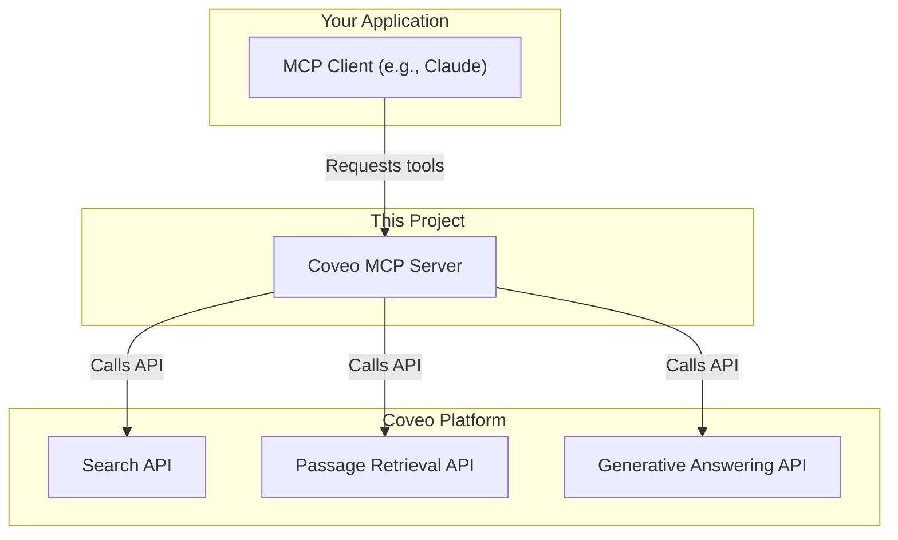

# Coveo MCP Server

> **Disclaimer**  
The Coveo MCP Server is provided as-is, intended purely for educational and exploratory purposes. It’s not a production-ready product.

## Overview
This is a simple MCP server that connects to **Coveo** and executes search queries. It provides tools for:

- Search functionality
- Passage retrieval
- Question answering

## How It Works
The Coveo MCP Server acts as a bridge, exposing powerful Coveo APIs as simple, consumable tools for any MCP-compatible client, like Anthropic's Claude.



## What You Can Build

By connecting your AI agents to Coveo's unified index, you can build powerful, secure, and accurate applications. For example:

- **A Customer Support Agent**: An automated agent that answers customer questions using your official knowledge base and product documentation, complete with citations.

- **An Internal Knowledge Chatbot**: A secure chatbot for employees to query internal resources like HR policies, technical documentation, or sales enablement materials, while respecting all user permissions.

- **A Commerce Copilot**: An assistant that helps shoppers find the best product by understanding natural language queries and retrieving precise information from product catalogs.

- **A Research Assistant**: An agent that can quickly summarize and synthesize information from a vast repository of documents by using `passage_retrieval` to gather context before generating a report.

## Available Tools

Expose Coveo's powerful APIs as simple, easy-to-use tools for your agents.

### 🛠️ search_coveo

Use search_coveo to retrieve metadata, titles, or URLs. Ideal for broadly exploring information, navigating sources, or presenting lists of content.

**Input:**
- `query` (string)
- `numberOfResults` (int, optional, default: 5)

**Output:** JSON formatted search results or an error message.

### 🛠️ passage_retrieval

Use passage_retrieval to extract highly relevant text snippets. Useful for building answers, summaries, or new documents from source material.

**Input:**
- `query` (string)
- `numberOfPassages` (int, optional, default: 5)

**Output:** JSON formatted passages or an error message.

### 🛠️ answer_question

Use answer_question when you need a complete, consistent, and well-structured answer, powered by Coveo's Relevance Generative Answering engine.

**Input:**
- `query` (string)

**Output:** A generated answer from Coveo sources with citations.


## Get Started in 4 steps
Go from zero to a running Coveo MCP server in minutes.

### 1. Clone the Repository
Get the source code on your local machine.
```bash
git clone https://github.com/coveo-labs/coveo-mcp-server.git
cd coveo-mcp-server
```

### 2. Configure Your Environment
Copy the example environment file and add your Coveo API credentials.
```bash
cp .env.example .env
```

Then, edit the `.env` file with your credentials:
```
COVEO_API_KEY="<your-api-key>"
COVEO_ORGANIZATION_ID="<your-organization-id>"
COVEO_ANSWER_CONFIG_ID="<your-answer-config-id>"
```

### 3. Install Dependencies
We recommend using uv for fast dependency management.
```bash
# Install in editable mode with development dependencies
# Note the quotes around '.[dev]' to prevent shell errors
uv pip install -e '.[dev]'
```

### 4. Run the Server
Start the server. By default, it uses the modern streamable-http transport.
```bash
python -m coveo_mcp_server
```

The server will be available at http://127.0.0.1:8000.

#### Alternative Transport Options
The server supports multiple transport methods:

- **Streamable HTTP** (Default): The new standard for MCP servers
    ```bash
    python -m coveo_mcp_server
    ```

- **SSE Transport** (Legacy): For older clients that require SSE
    ```bash
    USE_SSE=true python -m coveo_mcp_server
    ```

- **STDIO Transport**: For direct stdio communication
    ```bash
    USE_STDIO=true python -m coveo_mcp_server
    ```

## Core Features

- **Asynchronous by Design**: Leverages `httpx` and `asyncio` for non-blocking API requests.
- **Grounded Generative Answering**: Go beyond search results with AI-generated answers complete with citations from your indexed content.
- **Semantic Passage Retrieval**: Intelligently extracts the most relevant text snippets, not just whole documents.
- **Easy Configuration**: Simple setup using a `.env` file for your Coveo credentials.
- **Multiple Transports**: Supports modern `streamable-http`, legacy `SSE`, and direct `STDIO` for maximum client compatibility.
- **Fully Tested**: Includes a comprehensive test suite with `pytest` to ensure reliability.

## Development & Testing

### Development Setup
If you want to edit the source code or contribute to this project, set up a local development environment.

1. **Create and Activate a Virtual Environment**

   First, create a virtual environment in the project's root directory. This will keep all the necessary dependencies isolated.

   ```bash
   # Create the virtual environment
   python -m venv .venv

   # Activate it (macOS/Linux)
   source .venv/bin/activate

   # Or activate it (Windows)
   # .\.venv\Scripts\activate
   ```

2. **Install Dependencies**

   With the virtual environment active, install the project in "editable" mode. This allows you to make changes to the code and have them immediately reflected without reinstalling.

   ```bash
   # Install in editable mode with development dependencies
   # Note the quotes around '.[dev]' to prevent shell errors
   uv pip install -e '.[dev]'
   ```

   This command installs the package in editable mode (`-e`) and includes the extra development dependencies (`[dev]`), such as pytest, which are defined in the `pyproject.toml` file.

## Testing Your Server

### Testing with MCP Inspector
You can test the server with the MCP Inspector in two ways:

1. Using the `mcp dev` command:
```bash
mcp dev src/coveo_mcp_server/__main__.py
```
This will start the MCP Inspector at http://localhost:5173, where you can interact with and test the server's functionality.

2. Using `npx` with the MCP Inspector:
```bash
npx @modelcontextprotocol/inspector \
  uv \
  --directory /[path to project]/coveo-mcp-server \
  run \
  --with mcp \
  mcp run src/coveo_mcp_server/__main__.py
```

### Testing your server with Claude for Desktop

First, make sure you have Claude for Desktop installed. You can install the latest version here. If you already have Claude for Desktop, make sure it's updated to the latest version.

We'll need to configure Claude for Desktop for whichever MCP servers you want to use. To do this, open your Claude for Desktop App configuration at `~/Library/Application Support/Claude/claude_desktop_config.json` in a text editor. Make sure to create the file if it doesn't exist.

Here's an example configuration:

```json
{
    "mcpServers": {
        "coveo_mcp_server": {
            "command": "uv",
            "args": [
                "--directory",
                "/ABSOLUTE/PATH/TO/PARENT/FOLDER/coveo-mcp-server/src/coveo_mcp_server",
                "run",
                "__main__.py"
            ]
        }
    }
}
```

Note: If Claude for Desktop cannot find the `uv` command, you may need to specify the full path in the configuration:
```json
"command": "/opt/homebrew/bin/uv"
```

### Running the Test Suite

This project includes comprehensive unit tests.

#### Running All Tests
To run the tests and generate a coverage report:
```bash
./run_tests.sh
```

Or use pytest directly:
```bash
pytest tests/ -v --cov=src/coveo_mcp_server
```

#### Testing Transport Modes

To verify all transport modes are working correctly:

```bash
python test_transports.py
```

This script will verify that:
- Streamable-HTTP transport starts correctly (default)
- SSE transport starts correctly (legacy)
- STDIO transport can be imported and initialized